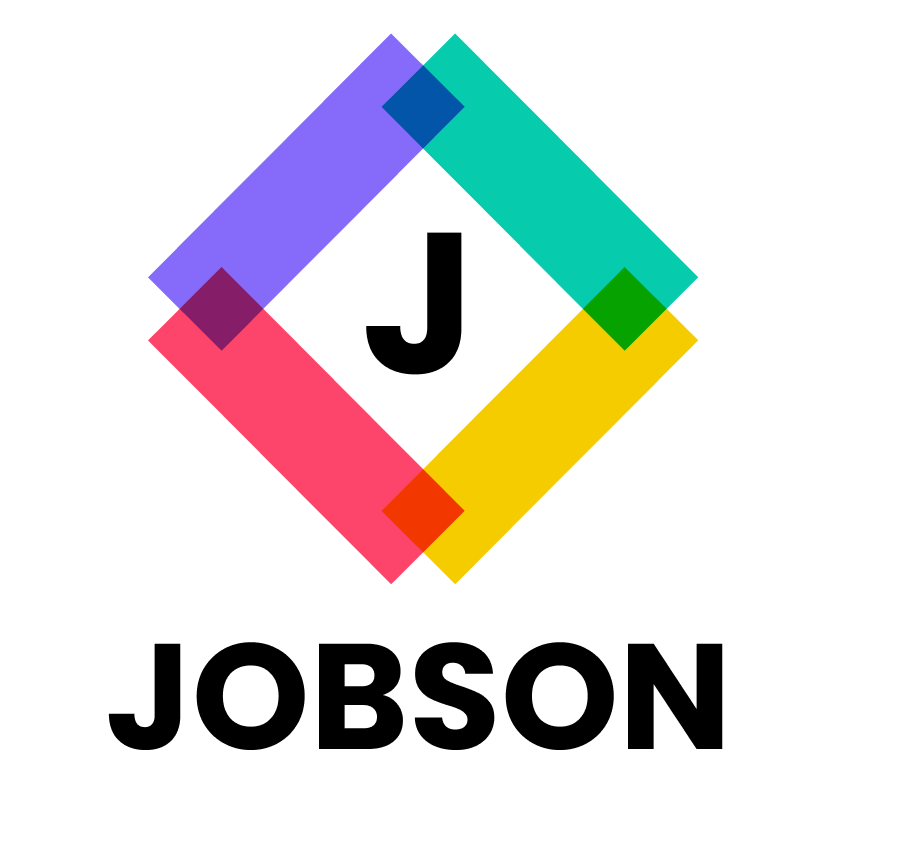

# Engenharia de Software (IF977)

  

O Jobson é uma plataforma que oferece análises profundas e intuitivas sobre o mercado de trabalho atual na área de TI, utilizando capacidades de Análise de Dados. Sua relevância está na geração de insights estratégicos para indivíduos e organizações interessados em entender o panorama do mercado, identificando tendências, demandas de emprego, salários, habilidades e qualificações em alta. Destaca-se por uma Interface de Usuário interativa e acessível, facilitando o acesso a visualizações dinâmicas de dados sobre o mercado de trabalho em TI. Utiliza uma infraestrutura de Back-end sofisticada para coletar dados do Google Jobs de forma automatizada, garantindo análises abrangentes e atualizadas. Em resumo, o Jobson é uma plataforma de dashboard que oferece ao usuário insights valiosos sobre o mercado de trabalho em TI, incluindo tendências e padrões salariais.

## Como rodar ▶️

## Deploy 🌐

## Tecnologias utilizadas 🖱️

- Python
- JavaScript
- MongoDB
- SerpAPI
- Streamlit.py

## Documentos 📂

- Screencast
- [Slides](./documents/Jobson%20-%20Apresenta%C3%A7%C3%A3o%20Final.pdf)
- [Ata de reunião - Notion](https://www.notion.so/Ata-de-Reuni-es-700e75ce3b2c4d36ac9c41f08066ff41)
- [Kanban de atividades](https://www.notion.so/Kanban-de-Atividades-32471482a8cd4ec5901a6908acdfe7d2)
- [Mockup Lo-fi/Hi-fi](https://www.figma.com/file/HB0jNKlTy2wOI7S3GFn9yn/Untitled?type=design&mode=design&t=qA5D5OFgqY0cPSII-0)
- [Documentação geral(Arquitetura, pitch, testes BDD, user stories, etc)](https://www.notion.so/Informa-es-Do-Projeto-33cfcd05bbb9438cb7bdaf999bb07874)

## Contribuidores

- Pedro Balbino - phsb@cin.ufpe.br
- Matheus Dalia - mdaa@cin.ufpe.br
- Newton Cardoso - ncrn@cin.ufpe.br
- Alexandre de Souza - asc5@cin.ufpe.br

## Professor

- Vinicius Cardoso Garcia
